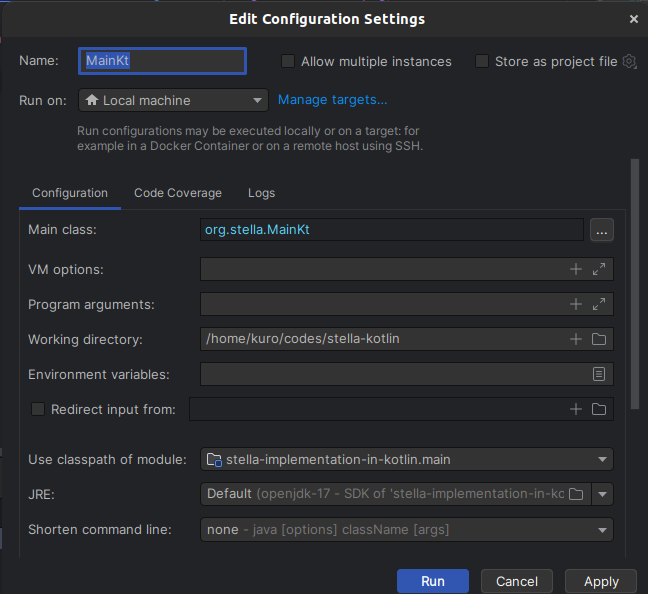
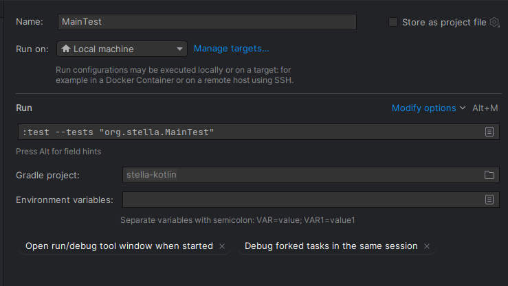

# stella-implementation-in-kotlin
Template for an implementation of Stella in Kotlin.

## Usage:

- Using the program:
  
  - To start the program, simply run `Main.kt` under `src/main/kotlin/org.stella/Main.kt` with the following configurations:
  
  

- Running tests:

  - To run the test suite run the gradle task `MainTest` with the following configurations:

  